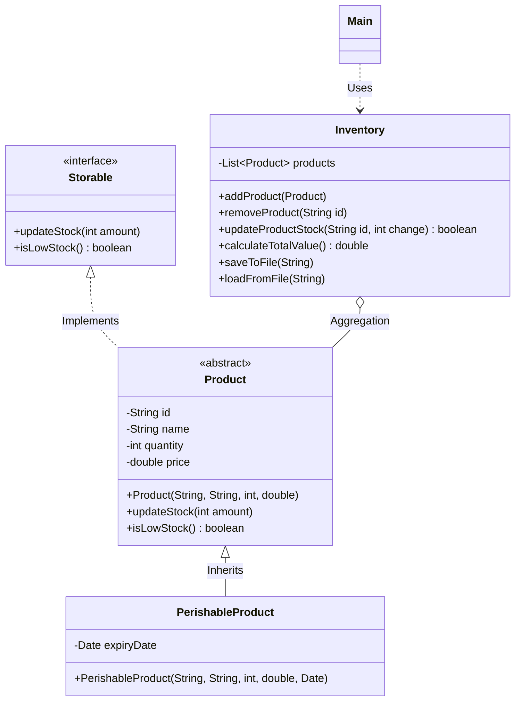

# 📦 Envanter Yönetim Sistemi (v2.0)

Bu proje, Java dili kullanılarak geliştirilmiş, Nesne Yönelimli Programlama (OOP) prensiplerini temel alan profesyonel bir **Envanter Yönetim Sistemi**'dir. Proje; modüler yapı, özel hata yönetimi, veri kalıcılığı ve kapsamlı bir test altyapısı sunar.

## 🛠️ Mimari ve UML Diyagramı

Sistem; arayüzler, soyut sınıflar ve servis odaklı bir mimari üzerine inşa edilmiştir. Sınıf ilişkilerini aşağıdaki şemada görebilirsiniz:



## 🚀 Öne Çıkan Özellikler

* **Gelişmiş Ürün Yönetimi:** Soyut `Product` sınıfı ve onu miras alan, son kullanma tarihli `PerishableProduct` yapısı.
* **Arayüz Odaklı Tasarım:** `Storable` interface'i ile tüm ürünlerin stok güncelleme ve kritik stok kontrol kurallarına uyması garanti altına alınmıştır.
* **Veri Kalıcılığı:** Envanterdeki tüm veriler `envanter.txt` dosyasına kaydedilir ve uygulama açılışında otomatik olarak yüklenir.
* **Gelişmiş Arama & Filtreleme:** Ürünleri isme veya belirli bir fiyat aralığına göre filtreleme özelliği.
* **Hata Yönetimi:** Geçersiz fiyat veya stok girişlerine karşı `InvalidProductException` ve `InvalidPriceException` sınıflarıyla güvenli çalışma ortamı.
* **Finansal Raporlama:** Envanterin toplam değerini hesaplama ve raporu dışa aktarma (Export) yeteneği.

## 🧪 Unit Testler (JUnit 5)

Proje, yazılım kalitesini artırmak için kapsamlı bir test setine sahiptir. Testler şu alanları kapsar:

* **Ürün Validasyonları:** Boş isim veya ID ile ürün oluşturma denetimleri.
* **Envanter Mantığı:** Ürün ekleme, silme ve stok değişim limitlerinin testi.
* **Bozulabilir Ürünler:** Tarih yönetimi ve `toString` çıktı doğrulamaları.

## 📂 Paket Yapısı

```text
src/
├── main/java/com/burak/
│   ├── exception/    # Özel hata sınıfları
│   ├── model/        # Temel sınıflar ve interface'ler
│   ├── service/      # İş mantığı (Inventory)
│   └── ui/           # Kullanıcı arayüzü (Main)
└── test/java/com/burak/
    ├── model/        # Model testleri
    └── service/      # Servis testleri

```

## 📋 Kurulum ve Çalıştırma

1. Projeyi klonlayın.
2. VS Code kullanıyorsanız, `lib/` klasörü içerisindeki **JUnit 5 Standalone JAR** dosyasını "Referenced Libraries" kısmına ekleyin.
3. `.vscode/settings.json` dosyasında `sourcePaths` ayarlarının `src/main/java` ve `src/test/java` olarak yapılandırıldığından emin olun.
4. `Main.java` dosyasını çalıştırarak interaktif menüyü kullanmaya başlayın.